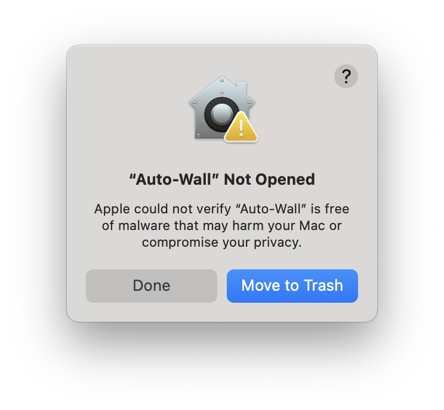

# Auto-Wall


**Auto-Wall** is a powerful tool for processing battle maps for virtual tabletop games. It automatically detects walls, obstacles, and lights in your maps and converts them into VTT-compatible wall data.

Watch the video:
[](https://youtu.be/gqkEIWwuJX4)

[](https://github.com/ThreeHats/auto-wall/releases)
[](https://opensource.org/licenses/MIT)

[Discord server](https://discord.gg/HUzEnZy8uJ)

## What's New in v1.3.1

- **Revamped UI:** 
  - New centralized mode management system with cleaner, more intuitive interface
  - Left sidebar with mode selection (Detect, Paint, Walls) and right panel with mode-specific settings
  - Improved visual hierarchy and reduced clutter
  - Better organization of detection, drawing, and export controls

- **Cross-Platform Support:**
  - **Windows:** Portable `.exe` application
  - **Linux:** `.deb` for Ubuntu/Debian based distros and AppImage for all others
  - **macOS:** `.dmg` bundle (unsigned - see installation notes below)

### Importing UVTT Files

- **FoundryVTT:** Use the [Universal Battlemap Importer](https://foundryvtt.com/packages/uvtt-importer) by Moo Man.
- **Roll20:** Use the [UniversalVTTImporter](https://github.com/shdwjk/UniversalVTTImporter) by The Aaron.
- **Arkenforge & Fantasy Grounds:** Both platforms support UVTT files natively—simply import your exported file.

---

## Features

### Automated Wall, Door, and Light Detection
- **Edge Detection:** Automatically finds walls using edge detection algorithms
- **Color-Based Detection:** Extract walls based on specific colors
- **Adjustable Detection Parameters:** Fine-tune detection sensitivity and results
- **High-Resolution Processing:** Option to process at full resolution for more accurate results
- **Light Detection:** Dedicated settings for detecting lights (currently not saved in presets)
- **Door Drawing:** Manually add doors in edit mode

### Editing and Refinement
- **Interactive Deletion:** Click to remove unwanted walls
- **Color Picking:** Extract colors directly from the map for better detection
- **Mask Editing:** Draw or erase walls manually with various drawing tools
- **Wall Thinning:** Automatically reduce wall thickness for cleaner results
- **Contour Merging:** Connect and simplify wall segments
- **Edit Walls Mode:** Draw, erase, and modify walls, doors, and lights

### Universal VTT (UVTT) Integration

- **Save as UVTT:** Export maps and wall data in the Universal VTT (UVTT) format, compatible with many virtual tabletops.
- **Workflow:** Export your map as UVTT from Auto-Wall, then follow the instructions for your VTT of choice to import walls, doors, lights, and map images.

## Installation

### Windows
1. Download the latest `.exe` from [autowallvtt.com](autowallvtt.com) or the [Releases page](https://github.com/ThreeHats/auto-wall/releases)
2. Run `Auto-Wall.exe`

### Linux
#### Option 1: Debian Package (.deb)
1. Download the latest `.deb` file from [autowallvtt.com](autowallvtt.com) or the [Releases page](https://github.com/ThreeHats/auto-wall/releases)
2. Install: `sudo dpkg -i auto-wall_{version}_amd64.deb`
3. Run from applications menu or terminal: `auto-wall`

#### Option 2: AppImage
1. Download the latest `.AppImage` file from [autowallvtt.com](autowallvtt.com) or the [Releases page](https://github.com/ThreeHats/auto-wall/releases)
2. Make executable: `chmod +x Auto-Wall-{version}-x86_64.AppImage`
3. Run: `./Auto-Wall-{version}-x86_64.AppImage`

*Replace `{version}` with the actual version number from the release (e.g., `1.3.1`).*

### macOS
1. Download the latest `.dmg` bundle from [autowallvtt.com](autowallvtt.com) or the [Releases page](https://github.com/ThreeHats/auto-wall/releases)
2. Open the `.dmg` file
2. Drag Auto-Wall to Applications folder
3. **Important:** The app is not notarized due to the $99/year cost. You will see something like this when trying to open the app:

To open the application, click done and go to Settings -> Privacy & Security. Scroll down to the bottom, and click "Open Anyway".

### From Source
1. Clone the repository:
   ```
   git clone https://github.com/ThreeHats/auto-wall.git
   ```

2. Install dependencies:
   ```
   cd auto-wall
   pip install -r requirements.txt
   ```

3. Run the application:
   ```
   python auto_wall.py
   ```

## Quick Start Guide

1. **Open an image:** Click "Open Image" or "Load from URL" to import your battle map
2. **Navigate the view:** Use scroll wheel to zoom, right-click and drag to pan
3. **Choose your tool mode:** Use the left sidebar to select between:
   - **Detect Mode:** For wall and light detection
   - **Paint Mode:** For manual drawing and editing
   - **Walls Mode:** For final wall editing and export
4. **Detection workflow:**
   - Select detection mode (Edge Detection or Color Detection)
   - Use detection presets or adjust parameters in the right panel
   - Fine-tune with sliders and settings
5. **Manual editing:** Switch to Paint mode for manual mask editing with various tools
6. **Wall editing:** Switch to Walls mode to:
   - Generate walls from your detection/drawing
   - Edit, move, or delete individual walls
   - Draw doors
7. **Export:** Save as UVTT file by opening the file menu and clicking "Save File" or using "ctrl + s"

## Usage Guide

### Application Layout

Auto-Wall features a three-panel interface:
- **Left Sidebar:** Mode selection (Detect, Paint, Walls)
- **Right Panel:** Mode-specific settings and controls
- **Center:** Image display with interactive tools

### Mode Overview

#### Detect Mode
Used for automatic wall and light detection:
- **Edge Detection:** Best for maps with clear wall lines
- **Color Detection:** Best for maps with distinct wall/background colors
- **Detection Presets:** Save and load detection configurations
- **Light Detection:** Automatically find light sources

#### Paint Mode  
Used for manual drawing and mask editing:
- **Drawing Tools:** Brush, line, rectangle, circle, ellipse, fill
- **Draw/Erase:** Toggle between adding and removing walls
- **Brush Size:** Adjustable brush size for detailed work

#### Walls Mode
Used for final wall editing and export:
- **Wall Editing:** Move, delete, or modify detected walls
- **Door Drawing:** Add doors and portals manually
- **Export Settings:** Configure UVTT export parameters

### Detection Modes

#### Edge Detection (Default)
Best for maps with clear wall lines:
- **Edge Sensitivity & Edge Threshold:** Controls edge detection precision - higher sensitivity finds more edges, higher threshold filters out noise
- **Min Area:** Filter out small artifacts
- **Smoothing:** Reduce noise (higher values = more smoothing)
- **Edge Margin:** Exclude detection near image edges

#### Color Detection
Best for maps with distinct colors for the walls or background:
1. Enable "Color Detection"
2. Add colors by:
   - Clicking "Add Color" and selecting from color picker
   - Using "Color Pick" mode to select colors directly from the image
3. Adjust threshold for each color to control matching sensitivity

#### Light Detection
- **Enable Light Detection:** Toggle light detection on/off
- **Brightness Threshold:** Control sensitivity to bright areas
- **Size Filters:** Set minimum and maximum light source sizes
- **Light Colors:** Add specific colors to detect as light sources
- **Merge Distance:** Combine nearby light sources

### Detection Presets

Save and load detection configurations:
- **Save Preset:** Store current detection settings
- **Load Preset:** Apply previously saved settings
- **Manage Presets:** Delete user-created presets
- **Default Presets:** Built-in configurations for common scenarios

### Editing Tools

#### Paint Mode Tools
Multiple drawing tools for precise mask editing:
- **Brush Tool:** Freehand drawing with adjustable size
- **Line Tool:** Draw straight lines
- **Rectangle Tool:** Draw rectangular areas
- **Circle Tool:** Draw circular areas  
- **Ellipse Tool:** Draw elliptical areas
- **Fill Tool:** Fill enclosed areas

#### Walls Mode Tools
- **Draw Walls:** Click and drag to draw new wall segments
- **Draw Doors:** Create doors and portals
- **Edit Mode:** Move wall endpoints by dragging
- **Delete Mode:** Click walls to remove them
- **Multi-selection:** Drag to select multiple walls for batch operations

#### Detection Mode Tools
- **Deletion Tool:** Click to remove unwanted detected areas
- **Thinning Tool:** Reduce thickness of detected walls
- **Color Pick Tool:** Select colors directly from the image (Color Detection mode)


### Export settings

- **Simplification Tolerance:** Controls how much wall details are simplified (0 = full detail)
- **Maximum Wall Segment Length:** Limits how long each wall segment can be
- **Maximum Number of Generation Points:** Caps the total number of generated points for performance
- **Point Merge Distance:** Connects nearby wall endpoints to fix gaps and lessen the number of walls
- **Angle Tolerance:** Determines when walls at different angles should merge
- **Maximum Straight Gap to Connect:** Maximum distance to bridge between straight nearby walls
- **Grid Snapping:** Optional alignment to a grid for precise positioning


### Development Setup
1. Clone the repository:
   ```bash
   git clone https://github.com/ThreeHats/auto-wall.git
   cd auto-wall
   ```

2. Create virtual environment:
   ```bash
   python -m venv .venv
   source .venv/bin/activate  # On Windows: .venv\Scripts\activate
   ```

3. Install dependencies:
   ```bash
   pip install -r requirements.txt
   ```

### Building Executables

```bash
python build.py --platform [linux|windows|macos]
```

#### Build Options
- `--clean`: Clean build artifacts before building
- `--skip-appimage`: Skip AppImage creation (Linux only)
- `--skip-deb`: Skip Debian package creation (Linux only)
- `--install-deps`: Install build dependencies only

## Contributing

Contributions are welcome! Please feel free to:

1. Report bugs and request features using the issue tracker
2. Submit pull requests with fixes and improvements
3. Suggest new detection algorithms or optimizations

## License

Auto-Wall is licensed under the MIT License. See [LICENSE](LICENSE) for details.

## Acknowledgments

- Uses [OpenCV](https://opencv.org/) for image processing
- Uses [scikit-learn](https://scikit-learn.org/) for color clustering  
- Uses [PyQt6](https://www.riverbankcomputing.com/software/pyqt/) for the user interface
- Uses [PyInstaller](https://www.pyinstaller.org/) for executable creation
- Special thanks to the TTRPG community for feedback and testing

---

*Made with ❤️ for the TTRPG community*
